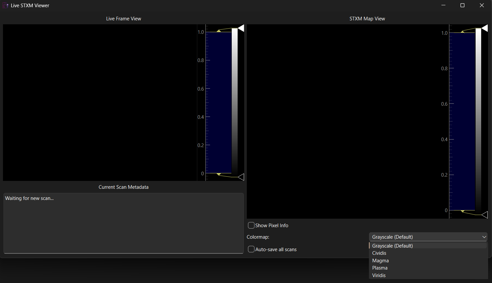
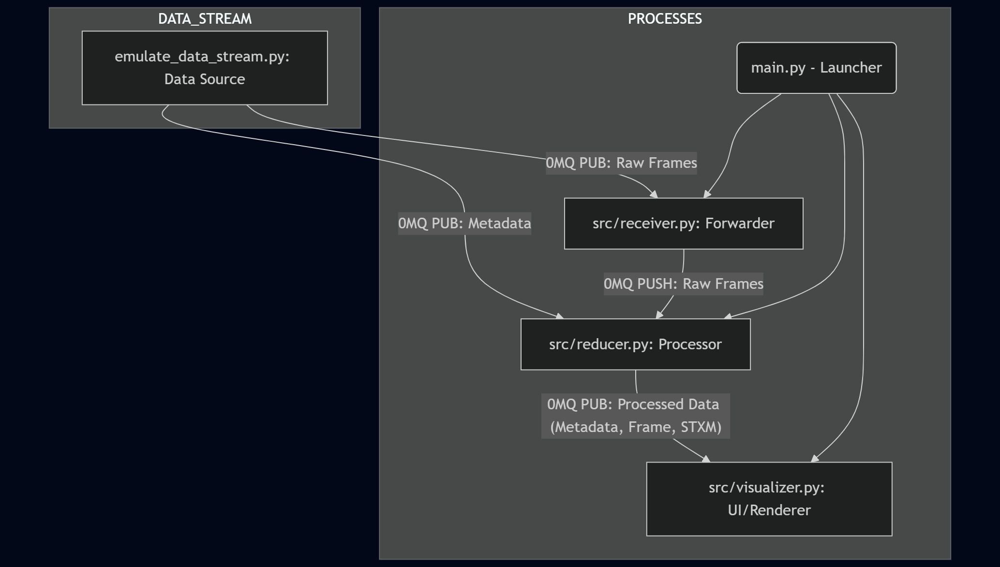

# LiveSTXM Viewer 🔬

A **real-time visualization application** for Scanning Transmission X-ray Microscopy (STXM) data streams, built with Python and high-performance libraries, **ZeroMQ (0MQ)** and **PyQtGraph**. The functionality of the viewer is tested using an emulator script that mimics the operation of a STXM experimental endstation, equipped with an area (2D) detector.

At the beginning of each scan, the experiment control software emits **scan metadata** via 0MQ (start/stop positions, step size, exposure, detector frame shape). The detector, in addition to file-writing, is also streaming **recorded data** via 0MQ.

## ✨ Features

The application uses a **dual-view interface** that allows simultaneous tracking of the detector frame and the STXM map. 



The UI is split into two sides:

### Left Side: Live Frame View & Status

* **Current Scan Metadata:** A log displays the timestamped details of each completed scan (start/stop positions, exposure time, frame shape). The log is prepended, showing the newest scan at the top.
* **Progress Tracking:** A progress bar beneath the Live Frame View shows the scan completion as a frame count and percentage (e.g., `[88/209] (42%)`).
* **Resilience (Standby Mode):** If the application waits for more than 15 seconds without receiving new metadata, the status log will show "STANDBY MODE," confirming the system is still active but idle.


### Right Side: STXM Map View & Controls

* **Intelligent Mapping:** The STXM map (built pixel-by-pixel) updates dynamically and correctly handles bidirectional motor scans by internally flipping the data to maintain a fixed $X_{min} \to X_{max}$ display axis.
* **Live Metrics:** The **"Show Pixel Info"** checkbox activates a crosshair. Moving the crosshair displays array indices (X, Y), real-time physical coordinates, and the precise floating-point signal intensity at any pixel.
* **Colormap Control:** A dropdown allows users to change the colormap of the STXM image, aiding in the visualization of subtle signal variations.


### Data Saving

* **Manual Save:** The **"Save Current Scan Data"** button activates after a scan is 100% complete.
* **Continuous Save:** The **"Auto-save all scans"** checkbox continuously saves all complete STXM maps until the application is closed.
* **Output Files:** All files are saved into a new `saved_data/` folder, with a filename format of `stxm_scan_[time_of_scan]` and include three formats for complete data integrity:
    * `.npy`: The high-precision, raw NumPy array data (for analysis).
    * `.json`: The corresponding scan metadata (for documentation).
    * `.png`: A visual snapshot of the final map (for quick review).

### System Working 🎥

Here is the system in action during a live scan:


## Getting Started

### Option 1: Executable (Recommended for Users)

The application provides two self-contained executable options:

* **GUI Only (`LiveSTXM.exe`):** Launches the application without a visible console window.
* **With Logs (`LiveSTXM_terminal.exe`):** Launches the application and keeps the console window open to display ZMQ connection status and process logs.

1.  **Download** the desired executable (`LiveSTXM.exe` or `LiveSTXM_terminal.exe`).
2.  Double-click the executable to launch the viewer.
3.  **Run the emulator** from a *separate* terminal using: `python emulator_data_stream.py`
### Option 2: Source Code

1.  **Clone the Repository:**
    ```bash
    git clone https://github.com/maimpilly/LiveSTXM_Viewer.git
    cd LiveSTXM_Viewer
    ```
2.  **Install Dependencies:**
    ```bash
    pip install -r requirements.txt
    ```
3.  **Run the System:**
    * Start the LiveSTXM viewer: `python main.py`
    * Start the Emulator script: `python emulate_data_stream.py`
4.  **Build Executable (After Changes):**

    ```bash
    pyinstaller --onefile --windowed --name LiveSTXM --icon="assets/icon.ico" --add-data "src;src" main.py
    ```
    (Remove `--windowed` to show the terminal logs.)

## Architecture

The application uses a **three-process architecture** connected via ZeroMQ (0MQ) for high-speed, decoupled communication. These processes are all called and monitored using the `main.py` file. The three-process architecture is key to the viewer's scalability.




| File | Role | Details |
| :--- | :--- | :--- |
| `emulator.py` | **Data Source** | Simulates X-ray detection hardware, streams random scan metadata and raw frame data via 0MQ. |
| `src/receiver.py` | **Frame Forwarder** | Subscribes to the raw data stream and forwards packets directly to the Reducer via a fast PUSH/PULL queue. It acts as a protective buffer.|
| `src/reducer.py` | **Processing Core** | Receives raw frames, calculates the STXM pixel sum (`np.sum()`), downsamples frames, and publishes reduced data to the viewer. |
| `src/visualizer.py` | **Visualization UI** | Receives metadata and reduced data. Manages data queues, thread-safe updates, and renders the dual-view interface. |

Further information about the architecture and working can be read in the [Architecture Notes](assets/Architecture_notes.md) file.